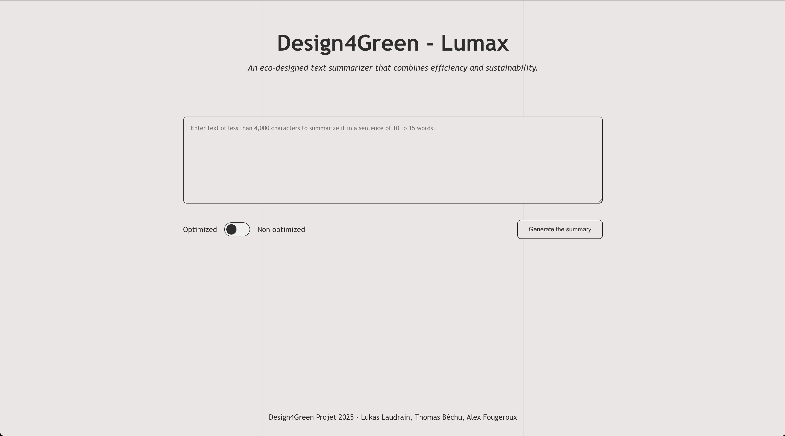

# Lumax — Design4Green 2025


**Lumax** is an eco-designed web application that summarizes texts (up to 4000 characters) into concise 10–15 word sentences, while measuring energy consumption, latency, and memory usage per request.

Built for the [Design4Green 2025](https://design4green.org/) hackathon by **Team 4**.

## Team

| Name | Role |
|------|------|
| **Thomas Béchu** | Developer |
| **Alex Fougeroux** | Developer |
| **Lukas Laudrain** | Developer |

## Features

- Text summarization powered by a fine-tuned GPT-NeoX model (Pythia-70M)
- Two inference modes: **Baseline** (FP32) and **Optimized** (LoRA fine-tuned)
- Real-time performance metrics: energy (Wh), latency (ms), memory (MB)
- Accessible UI with ARIA support and screen-reader friendly components
- Eco-design focused — lightweight model, energy tracking with CodeCarbon

## Tech Stack

| Layer | Technologies |
|-------|-------------|
| **Frontend** | Next.js 16, React 19, TypeScript, CSS Modules, Headless UI, Zod |
| **Backend** | Python, Flask 3, Flask-CORS |
| **AI / ML** | PyTorch, Hugging Face Transformers, PEFT (LoRA), Accelerate |
| **Metrics** | CodeCarbon (energy), psutil (memory) |
| **Testing** | Vitest, Testing Library, jsdom |
| **Code Quality** | ESLint, Prettier, TypeScript strict mode |

## Project Structure

```
D4G-2025/
├── ai-models/                    # Model training & fine-tuned weights
│   ├── finetuned-pythia-70m-cnn/ # LoRA adapter + tokenizer
│   ├── train.py                  # Fine-tuning script
│   ├── test.py                   # Model evaluation
│   └── requirements.txt
├── src/
│   ├── backend/                  # Flask API server
│   │   ├── app.py                # API routes & model inference
│   │   └── requirements.txt
│   └── frontend/                 # Next.js web application
│       ├── src/
│       │   ├── app/              # Pages & server actions
│       │   ├── components/       # UI components
│       │   ├── utils/            # Schemas & helpers
│       │   └── styles/           # Global CSS
│       ├── tests/                # Unit tests
│       └── package.json
├── documentation/                # Project assets
└── README.md
```

## Prerequisites

- **Python** 3.10+
- **Node.js** 18+ with **pnpm** 10+
- (Optional) CUDA-compatible GPU for faster inference

## Installation

### 1. Clone the repository

```bash
git clone https://github.com/<your-org>/D4G-2025.git
cd D4G-2025
```

### 2. Backend

```bash
cd src/backend
python -m venv env
source env/bin/activate        # Windows: env\Scripts\activate
pip install -r requirements.txt
```

### 3. Frontend

```bash
cd src/frontend
pnpm install
cp .env.example .env.local     # Configure API URL if needed
```

### 4. AI Models (optional — pre-trained weights are included)

```bash
cd ai-models
python -m venv env
source env/bin/activate
pip install -r requirements.txt
python train.py                # Re-train the model
```

## Usage

### Start the backend

```bash
cd src/backend
source env/bin/activate
python app.py
```

The API will be available at `http://localhost:5000`.

### Start the frontend

```bash
cd src/frontend
pnpm dev
```

The app will be available at `http://localhost:3000`.

### API

**POST** `/summarize`

```json
{
  "text": "Your text to summarize (max 4000 characters)",
  "optimized": false
}
```

**Response:**

```json
{
  "summary": "A concise 10-15 word summary.",
  "energy": 0.00092,
  "latency": 150.42,
  "memory": 420.5
}
```

| Field | Unit | Description |
|-------|------|-------------|
| `summary` | — | Generated summary |
| `energy` | Wh | Energy consumed during inference |
| `latency` | ms | Inference time |
| `memory` | MB | Memory usage delta |

**GET** `/health` — Returns `{ "status": "healthy" }`

## AI Model

| Property | Value |
|----------|-------|
| Base model | EleutherAI/pythia-70m-deduped (70M params) |
| Dataset | CNN/DailyMail v3.0.0 |
| Fine-tuning | LoRA (r=16, alpha=64, dropout=0.1) |
| Training | 2 epochs, batch size 4, lr 1e-3 |
| Adapter size | ~3.2 MB |

## Testing

```bash
cd src/frontend
pnpm test              # Run tests
pnpm test:coverage     # Run with coverage report
pnpm lint              # Formatting + type-check + ESLint
```

## Example



## License

This project was created for the Design4Green 2025 hackathon.
